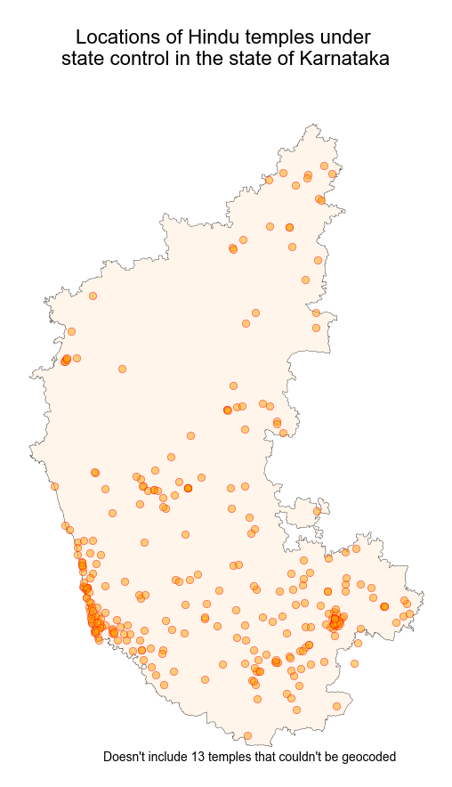

#### || Shree Ganeshaya Namaha ||

# Karnataka Hindu Temples under state control

This repo contains a dataset of 327 temples in Karnataka that are under state control.

### Data
1. Temple list: Raw data of 327 temples under state control was extracted from the state's HRCE website: <a href="https://itms.kar.nic.in/hrcehome/temple_list.php">https://itms.kar.nic.in/hrcehome/temple_list.php</a>.  
2. Locations of temples were obtained using geocoding. Locations of 26 temples couldn't be geocoded by the algorithm. Out of these 26 locations, 13 locations could be geolocated and subsequently geocoded using a manual inspection process. Some other data fields were like address, ZIP code etc. were also updated in the process.  
3. Shape file of Karnataka state was obtained from <a href="http://projects.datameet.org/maps/states/">here</a>.  

### Mapping
These locations were plotted on map of Karnataka state using `geopandas`. Below is a map that shows the locations of these temples:  
  
 

### Future analyses
In the future, the analysis can be extended to HRCE contributions from each temple, along with other financial data. 

### Caveats
It is possible that the geocoding algorithm was inaccurate. Please suggest any changes to the dataset by writing to vindicindic@gmail.com

#### Notes:
1. Please suggest any corrections or analyses by writing to vindicindic@gmail.com
2. Please feel free to use this dataset in your analysis with proper acknowledgement.
